# XEOXO Web - Activity Diagram Notes

## Ghi chú ngắn

- Ưu tiên vẽ theo nghiệp vụ mục tiêu.
- Có vài điểm docs và code hiện tại chưa khớp hoàn toàn:
  - `customization request`: chốt theo hướng `measurement_snapshot` là source of truth; profile mặc định chỉ là side effect khi user muốn lưu
  - `measurement appointment`: docs có branch check slot/guest customer rõ hơn code hiện tại
  - `measurement profile`: code hiện tại đang dùng flow `GET/PUT /api/v1/measurement-profiles/current`
  - `refund`: nên tách riêng `hủy đơn trước giao hàng` và `hoàn tiền sau return request`

## 1. Checkout Preview - Voucher / Reward

Mục tiêu: tính lại tiền checkout trước khi đặt hàng, không tin dữ liệu tính ở frontend.

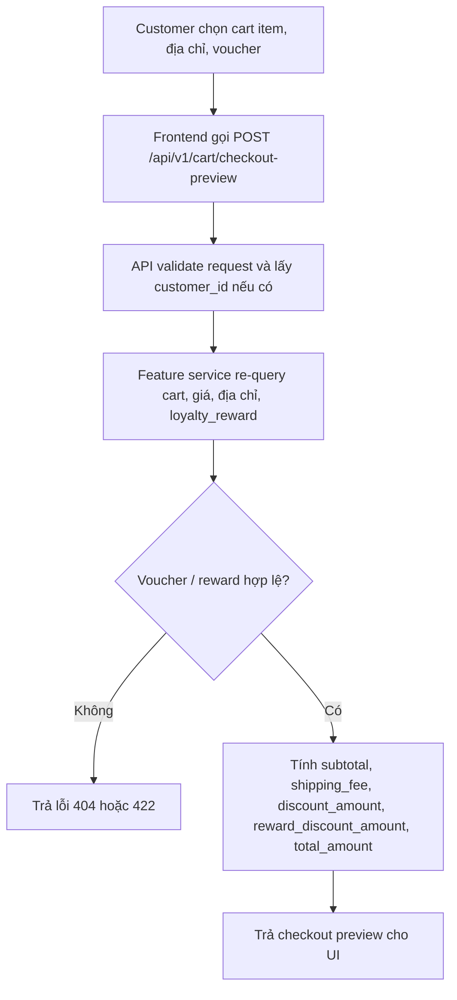

## 2. Đặt Hàng - Consume Reward - Ghi Dữ Liệu Bán Hàng

Mục tiêu: tạo order theo transaction atomic, consume reward và trừ tồn kho cùng một lần xử lý.

Xử lý member và guest:
- `Member`: lấy `customer_id` từ session, dùng `address_id` hoặc địa chỉ mới, đơn nằm trong lịch sử tài khoản.
- `Guest`: không tin `customer_id` từ client; backend phải tìm hoặc tạo `iam.customer` với `customer_type = GUEST` theo phone/email, rồi gắn `sales_order.customer_id` vào row guest đó.
- DB lưu:
  - `iam.customer`: 1 row `GUEST` hoặc `MEMBER`
  - `iam.address`: tạo row địa chỉ nội bộ nếu guest checkout hoặc member nhập địa chỉ mới
  - `sales.sales_order.customer_id`: luôn trỏ về một `customer_id`, kể cả guest
  - `sales.shipping.address_id`: luôn có địa chỉ đã lưu để phục vụ giao hàng
- Quản lý về sau:
  - `Member`: xem lịch sử bằng tài khoản
  - `Guest`: tra cứu bằng `order_code + contact`
  - các flow `lookup`, `cancel`, `return`, `review` đều dựa vào `sales_order.customer_id` + đối chiếu `CUSTOMER.phone/email`

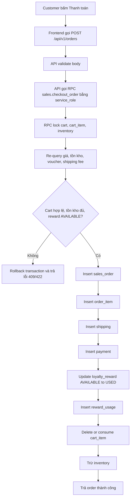

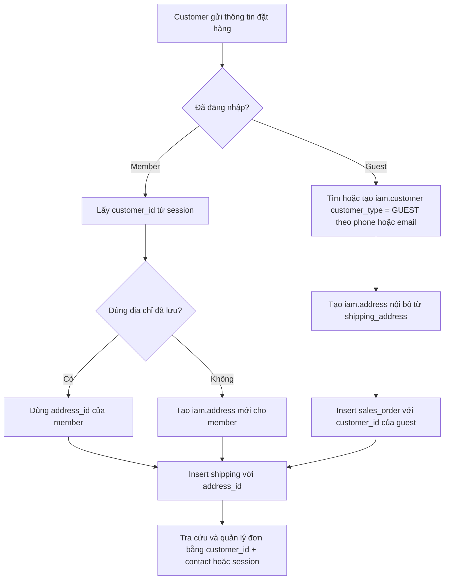

## 3. Cập Nhật Hạng Thành Viên

Mục tiêu: cộng hoặc trừ chi tiêu theo trạng thái đơn và đánh giá lại tier thành viên.

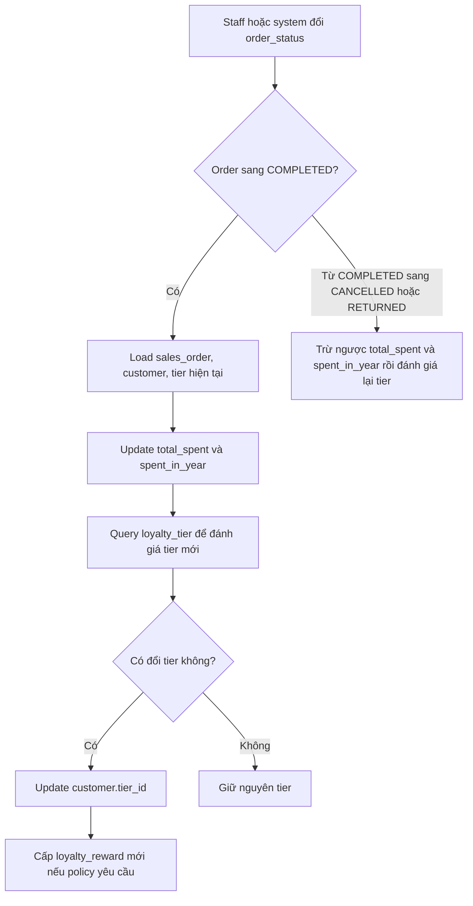

## 4. Đặt Lịch May Đo

Mục tiêu: nhận lịch hẹn, kiểm tra slot và tạo appointment trạng thái chờ xác nhận.

Xử lý member và guest:
- `Member`: lấy `customer_id` từ session rồi gắn thẳng vào lịch hẹn.
- `Guest`: backend nên tìm hoặc tạo `iam.customer` với `customer_type = GUEST` theo phone/email, rồi gắn `measurement_appointment.customer_id` vào row guest đó.
- DB lưu:
  - `customization.measurement_appointment.customer_id`: nên luôn có giá trị để support `lookup`, `cancel`, `confirm`
  - `iam.customer.phone/email`: là dữ liệu đối chiếu cho guest
- Quản lý về sau:
  - `Member`: xem danh sách qua `GET /api/v1/measurement-appointments`
  - `Guest`: tra cứu qua `appointment_id + contact`
  - huỷ lịch hoặc xác thực lịch guest đều check contact khớp với `CUSTOMER` gắn vào appointment

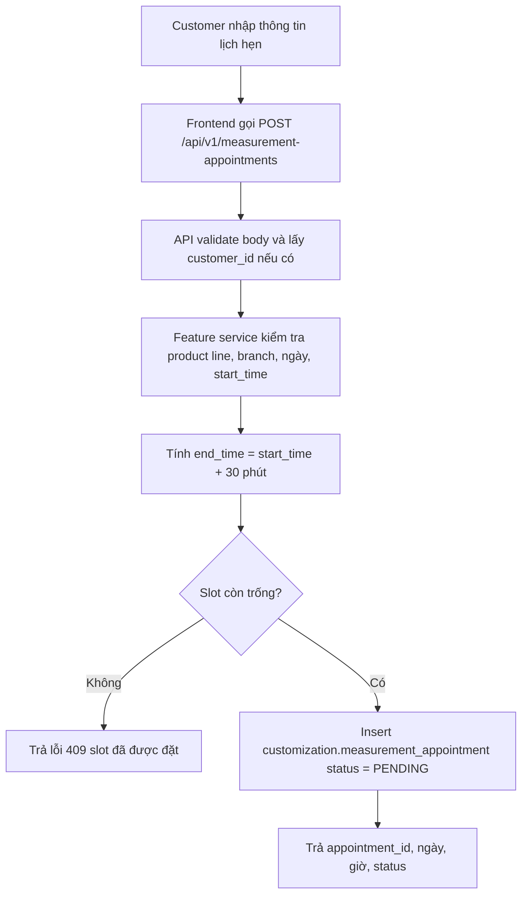

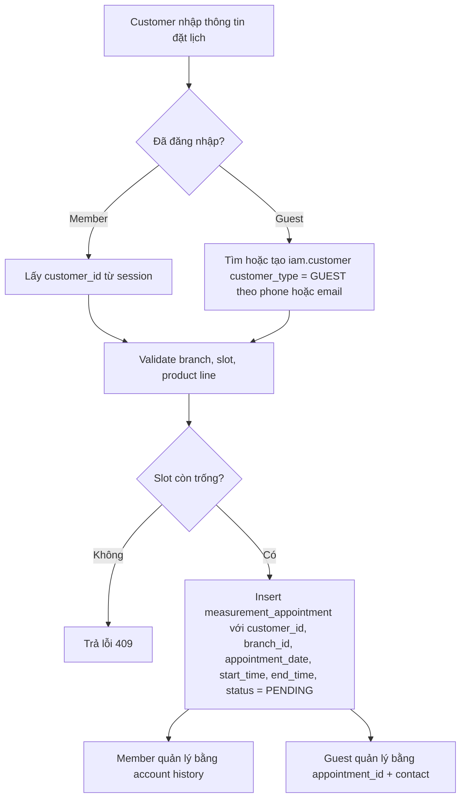

## 5. Tạo Customization Request

Mục tiêu: lưu yêu cầu may đo cá nhân, tính giá custom và gắn số đo cho yêu cầu đó.

DB lưu số đo:
- `Code hiện tại` lưu thêm `customization_request.measurement_snapshot` dạng JSON, ví dụ:
```json
{
  "component_id": 123,
  "component_type": "AO",
  "measurements": {
    "height": 165,
    "weight": 52,
    "chest": 84,
    "waist": 68
  },
  "note": "May ôm vừa",
  "source": "CUSTOMIZE_MODAL",
  "saved_as_default": true,
  "created_at": "2026-07-09T10:00:00Z"
}
```
- JSON này là `snapshot tại thời điểm tạo request`, dùng để giữ nguyên số đo gắn với đơn/customization đó, kể cả sau này profile mặc định của khách thay đổi.

`measurement_profile` và `measurement_profile_detail`:
- `measurement_snapshot` là source of truth cho giao dịch customize.
- `measurement_profile` và `measurement_profile_detail` chỉ dùng cho hồ sơ mặc định của member.
- nếu `customerId` có và `save_as_default = true` thì gọi `upsertProfile(...)`
- `measurement_profile`: không tạo profile mới mỗi lần; nếu đã có profile active thì `update` profile đó
- `measurement_profile_detail`: không update từng dòng; code đang `delete toàn bộ detail cũ` rồi `insert lại toàn bộ detail mới`
- nếu guest hoặc không chọn `save_as_default` thì không bắt buộc ghi `measurement_profile/detail`; dữ liệu số đo chính chỉ nằm trong `measurement_snapshot`

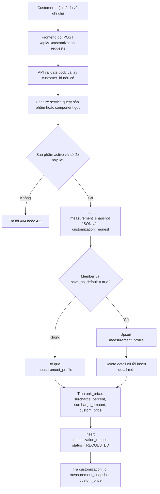

## 6. Thêm Item Customize Vào Cart Và Checkout

Mục tiêu: đưa customization đã tạo vào cart rồi đi tiếp qua flow checkout/order chuẩn.

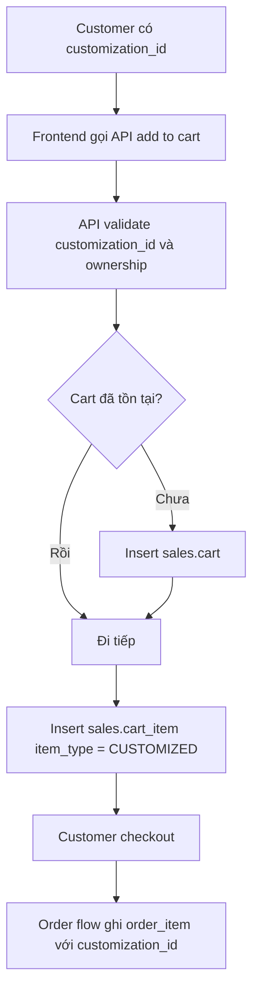

## 7. Hủy Đơn Trước Giao Hàng Và Refund

Mục tiêu: hủy đơn hợp lệ, hủy shipping và tạo refund nếu khách đã thanh toán trước.


## 8. Return Request Và Hoàn Tiền Sau Giao Hàng

Mục tiêu: tiếp nhận yêu cầu đổi trả sau giao hàng, staff duyệt và hoàn tiền nếu đủ điều kiện.

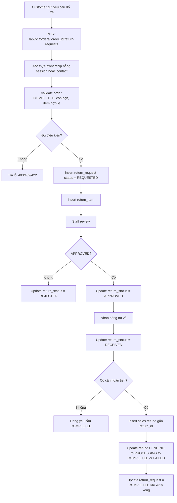

## 9. Lấy Hồ Sơ Số Đo Hiện Tại

Mục tiêu: lấy profile số đo active mới nhất của member để prefill form.

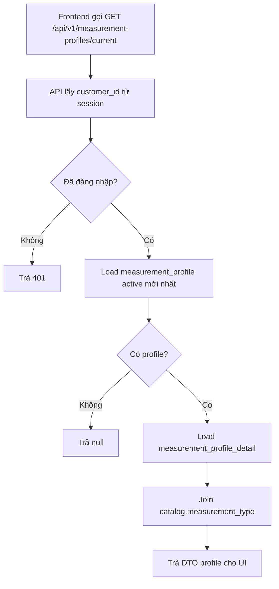

## 10. Upsert Hồ Sơ Số Đo Mặc Định

Mục tiêu: lưu lại profile số đo mặc định của member để dùng lại ở các lần sau.

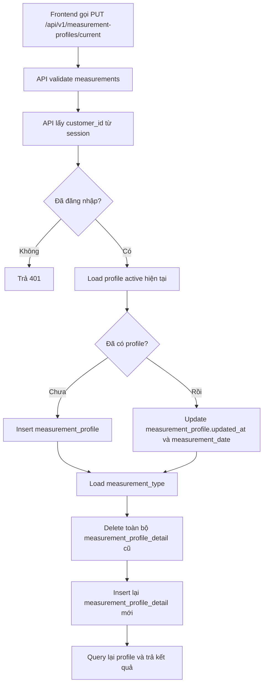

## 11. Update Số Đo Cho Customization Request

Mục tiêu: cập nhật số đo của yêu cầu may đo bằng cách sửa `measurement_snapshot`; nếu member muốn lưu mặc định thì cập nhật profile như side effect riêng.

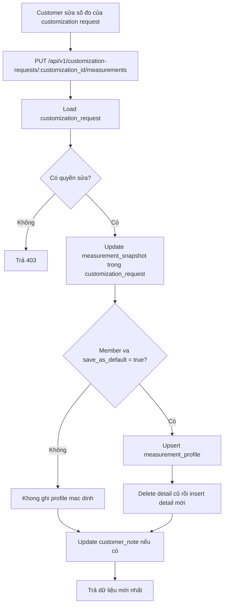
