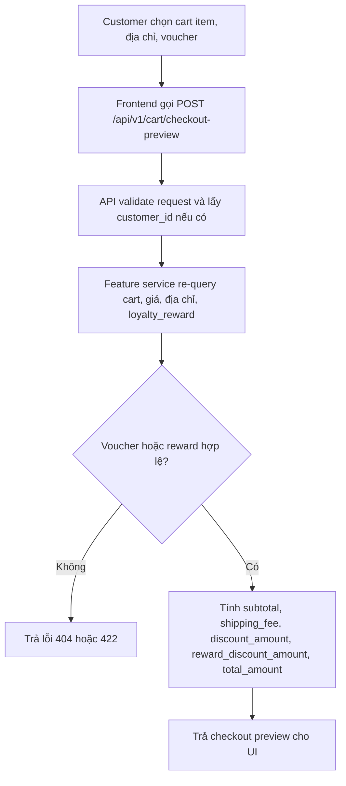
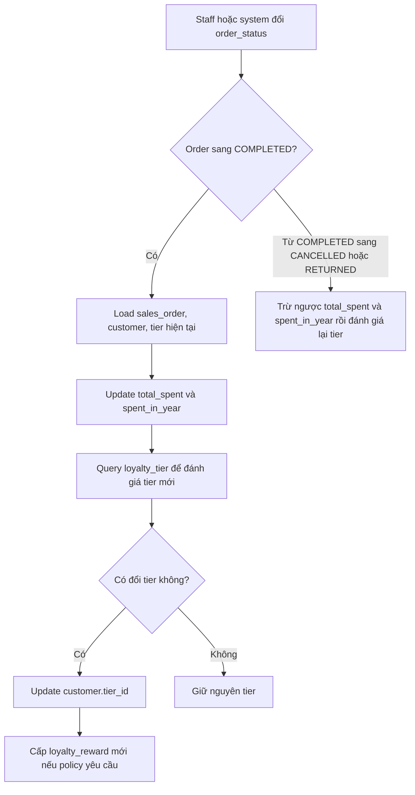
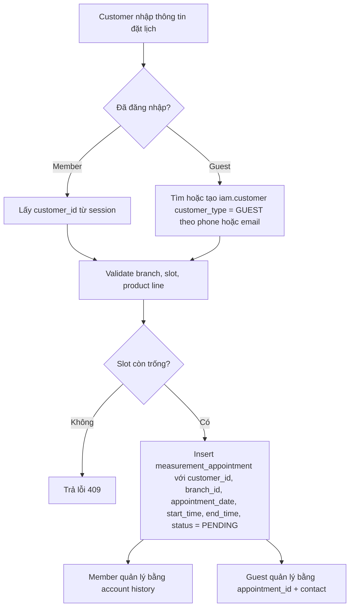
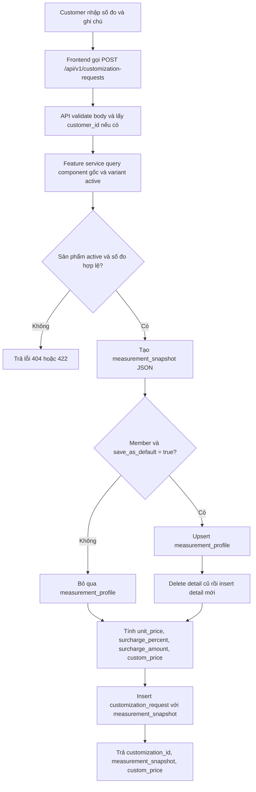
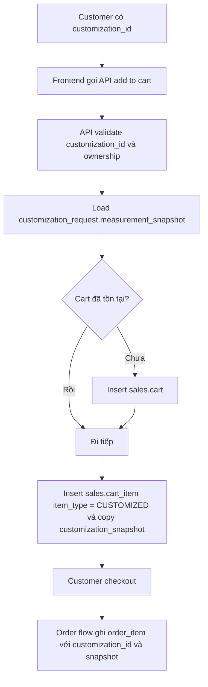
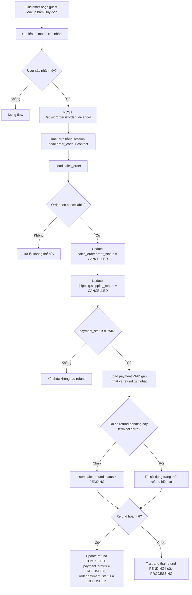
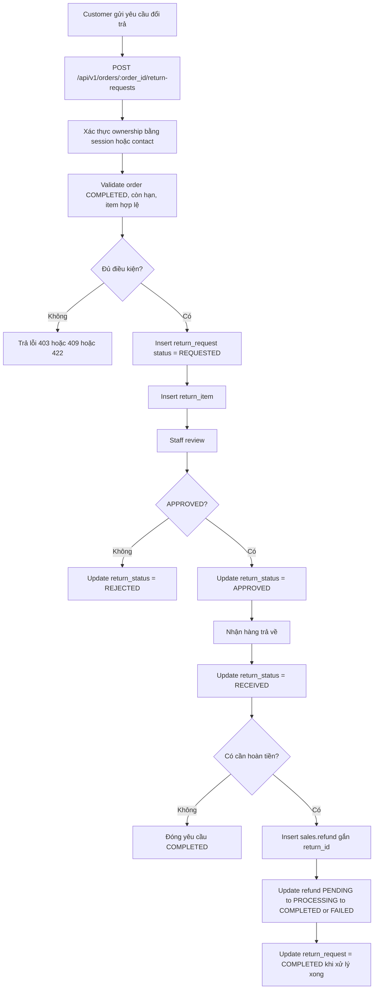
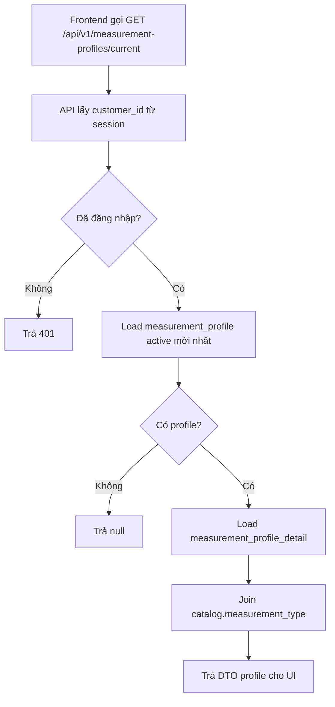
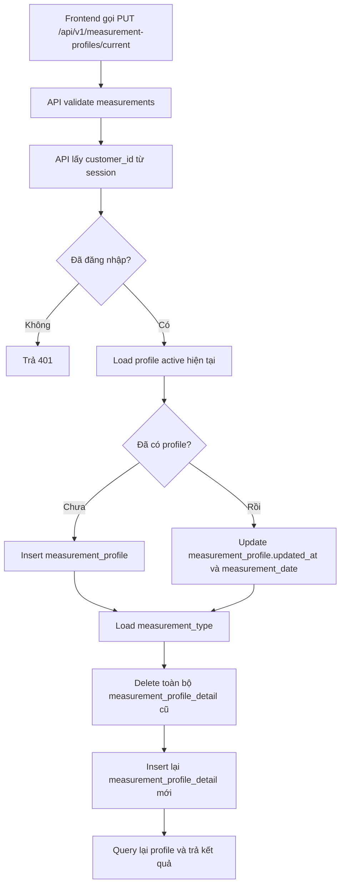
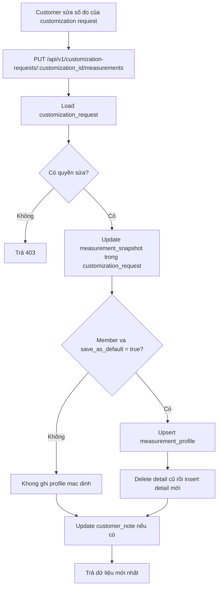

# XEOXO Web - Activity Diagram Notes

## Ghi chú ngắn

- `customization_request.measurement_snapshot` là source of truth cho dữ liệu giao dịch may đo.
- `measurement_profile` và `measurement_profile_detail` chỉ là hồ sơ mặc định của member, chỉ cập nhật khi user chọn lưu.
- `Guest` phải được map vào `iam.customer` với `customer_type = GUEST` để các flow lookup/cancel/return hoạt động ổn định.

## 1. Checkout Preview - Voucher / Reward

Mục tiêu: tính lại tiền checkout trước khi đặt hàng, không tin dữ liệu tính ở frontend.

## 2. Đặt Hàng - Member và Guest

Mục tiêu: tạo order theo transaction atomic, consume reward và trừ tồn kho cùng một lần xử lý.

## 3. Cập Nhật Hạng Thành Viên

Mục tiêu: cộng hoặc trừ chi tiêu theo trạng thái đơn và đánh giá lại tier thành viên.

## 4. Đặt Lịch May Đo - Member và Guest

Mục tiêu: nhận lịch hẹn, kiểm tra slot và tạo appointment trạng thái chờ xác nhận.

## 5. Tạo Customization Request

Mục tiêu: lưu yêu cầu may đo cá nhân, tính giá custom và lưu snapshot số đo bất biến cho giao dịch.

## 6. Thêm Item Customize Vào Cart Và Checkout

Mục tiêu: đưa customization đã tạo vào cart rồi đi tiếp qua flow checkout/order chuẩn.

## 7. Hủy Đơn Trước Giao Hàng Và Refund

Mục tiêu: hủy đơn hợp lệ, hủy shipping và tạo refund nếu khách đã thanh toán trước.

## 8. Return Request Và Hoàn Tiền Sau Giao Hàng

Mục tiêu: tiếp nhận yêu cầu đổi trả sau giao hàng, staff duyệt và hoàn tiền nếu đủ điều kiện.

## 9. Lấy Hồ Sơ Số Đo Hiện Tại

Mục tiêu: lấy profile số đo active mới nhất của member để prefill form.

## 10. Upsert Hồ Sơ Số Đo Mặc Định

Mục tiêu: lưu lại profile số đo mặc định của member để dùng lại ở các lần sau.

## 11. Update Số Đo Cho Customization Request

Mục tiêu: cập nhật số đo của yêu cầu may đo bằng cách sửa `measurement_snapshot`; nếu member muốn lưu mặc định thì cập nhật profile như side effect riêng.

